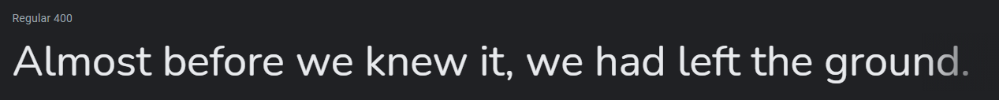

# Simple TIC-TAC-TOE Game

This is a fully responsive simple tic-tac-toe game written in HTML, CSS, and JavaScript.

    
    
    
    
    

    

## Table of Contents

- [Design](#design)
  - [Fonts](#fonts)
  - [Color Scheme](#color-scheme)

- [Creator / Maintainer](#creator--maintainer)

---

## Design

### Fonts

[Nunito](https://fonts.google.com/specimen/Nunito) - this font is used for everything because it looks good in titles and the 'X' and 'O' in the game

### Color Scheme

- Bdazzled Blue - title and new game button
- Generic Viridian - Player X text and tile color
- Blood Red - Player O text and tile color
- Cultured - website background color
- Spanish Gray - inactive player, game grid borders, tile hover, and winner's tiles background color

---

## Built With

- [HTML5](https://www.w3schools.com/html/)
- [CSS3](https://www.w3schools.com/css/)
- [JavaScript](https://www.w3schools.com/js/DEFAULT.asp)
- Hosted on [Netlify](https://www.netlify.com/)

---

### Creator / Maintainer

comnsens ([mirelse](https://github.com/mirelse))

If you have any questions, comments, or concerns, feel free to contact me below.

  

 
---
